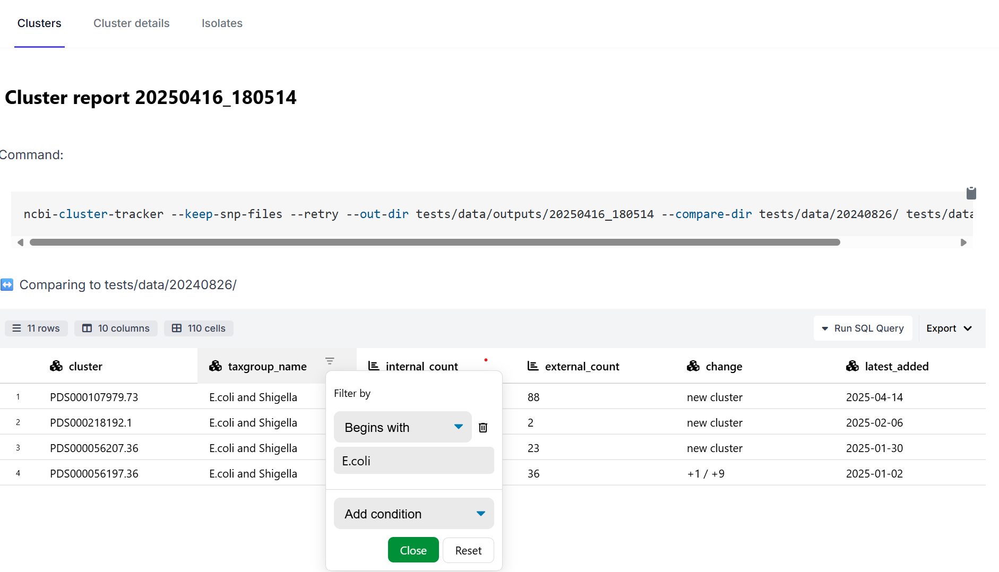
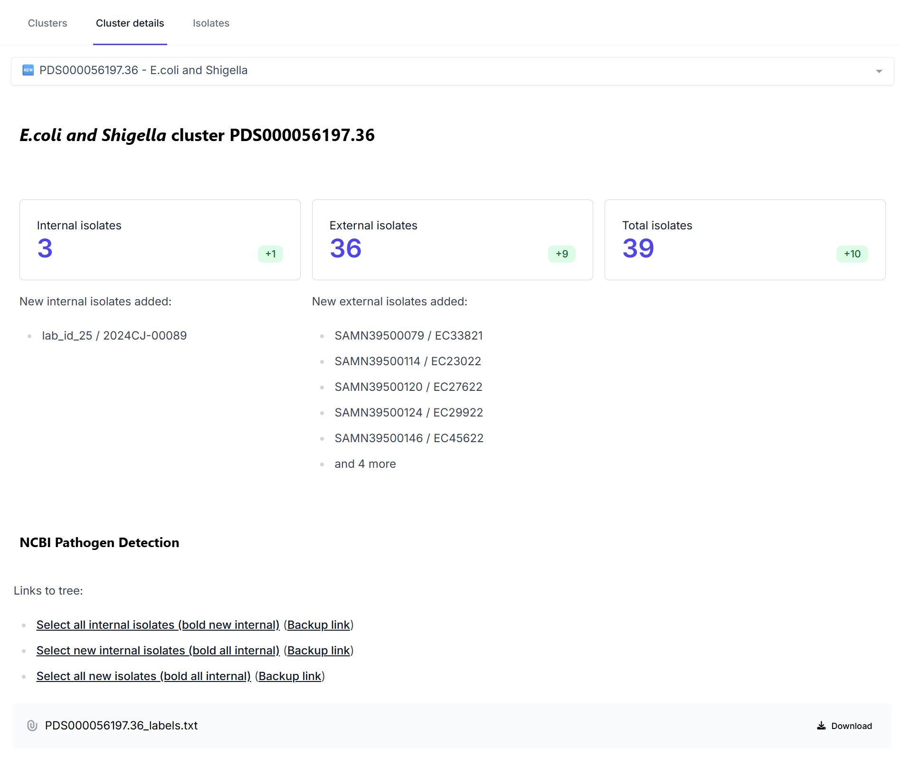
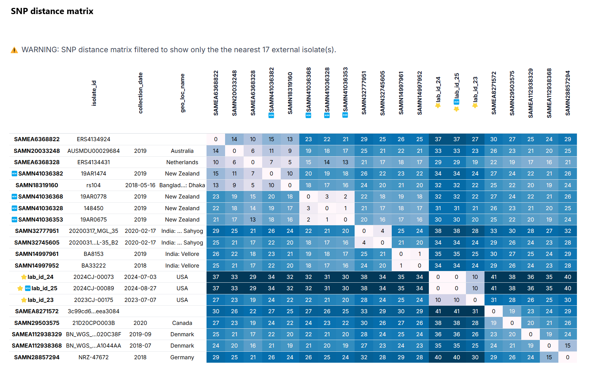

# ncbi-cluster-tracker

> ⚠️ This tool is in early stages of development

ncbi-cluster-tracker is a tool for creating static, shareable HTML reports for tracking SNP clusters within the [NCBI Pathogen Detection](https://www.ncbi.nlm.nih.gov/pathogens/) system. Given an input sample sheet CSV containing BioSample IDs for isolates of interest (referred to as "internal isolates"), the tool creates a report with a high-level overview of all of the clusters associated with the internal isolates. For each cluster the output report links to the corresponding NCBI Pathogen Detection tree and displays addition visualizations such as a pairwise SNP distance matrix heatmap. Any additional metadata or alternate IDs provided in the sample sheet are used to further annotate the internal isolates within the report.

### Clusters tab
The Clusters tab contains a table of clusters and their isolate counts. Columns in the table can be sorted and filtered. A Gantt chart is displayed below the table showing the timeline of when the first isolate appeared in each cluster and when the most recent isolate was added. 



### Isolates tab
The Isolates tab contains a table with details about the internal isolates, such as which cluster (if any) they belong to, their BioSample metadata, and any custom metadata provided in the sample sheet. SQL can be used directly in the report to query this table and the Clusters table.


### Cluster details tab
The Cluster details tab indicates the number of internal and external isolates in the cluster and provides a link to the tree in the NCBI Pathogen Detection website. The URL is set to select and highlight the internal isolates by default. A custom labels file is provided to annotate the tree with any alternate sample IDs and other additional metadata.



This section of the report shows a SNP distance matrix. Since there is a large number of isolates in this particular example cluster, the matrix is filtered to only show the nearest external isolates.



This section of the report also provides a histogram showing the isolate counts over time (by record creation date).


## Requirements
Currently a Google Cloud Platform account is required to use this tool, since it relies on NCBI's public Google BigQuery [`pdbrowser`](https://www.ncbi.nlm.nih.gov/pathogens/docs/gcp/) dataset to download isolate and cluster metadata.

## Installation
> ⚠️ Currently installation requires cloning the repository, but the plan is for the tool to eventually be installable directly through Conda or pip.

1. Clone repository

```
git clone https://github.com/CDPHE-bioinformatics/ncbi-cluster-tracker.git
```

2. Install dependencies with conda

```
conda env create -f environment.yml
conda activate ncbi-cluster-tracker
```

3. Ensure logged in to Google Cloud Platform account

```
gcloud auth login
```

4. Run with test sample sheet

```
python main.py tests/sample_sheet.csv
```

## Usage

```
usage: main.py [-h] [--use-local | --no-use-local] sample_sheet

positional arguments:
  sample_sheet          CSV sample sheet with required "biosample" column and any additional metadata columns. Use "id" column for alternate isolate IDs

options:
  -h, --help            show this help message and exit
  --use-local, --no-use-local
                        Do not query BigQuery or NCBI, assumes data has already been downloaded
```
